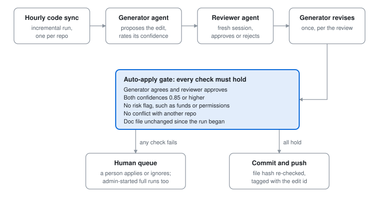

# ai-prd: agents for 100+ product and engineering staff

| Users | Agents | PRs reviewed | Runtime | Backend |
| :---: | :---: | :---: | :---: | :---: |
| 100+ staff | 5, four start on their own | 50+ | Claude Agent SDK → Codex | 42k lines of Python · 426 tests |

ai-prd gave 100+ product and engineering staff at CoinEx an assistant that answered from the company's code, requirements and docs, with sources. Background agents reviewed PRs without anyone starting them, and doc edits committed only when a second agent and a code gate approved. I built it as main developer from April 2026 until the company wound down in September 2026; my lead reviewed and set direction.

## The problem

Requirements lived in ClickUp, business rules in docs and the logic in code, so everyone gave AI their own partial context. Answers came back without evidence.

An earlier tool generated business docs from code, but PMs could not use the output. The real need was narrower: non-engineers asking how something works today, with sources.

## What runs on its own

Four of the five agents start without a person: GitHub, ClickUp, code changes and other internal services trigger them.

| Agent | Trigger | What it does | Output | Human step |
| --- | --- | --- | --- | --- |
| PR review | GitHub poll every 5 min; first review request on a non-draft PR | Reviews the PR in its own git worktree, against the linked ClickUp requirement and a review policy | Report emailed to the PR author | Author decides what to fix |
| Requirement review | Hourly ClickUp sync; trivial edits skipped | Checks the changed spec with a requirement-check Skill | Review file with an unread badge | PM reads it; posting back to ClickUp is off by default |
| Business-doc update | After each hourly code sync | A generator proposes edits; an independent reviewer checks them | Git commit when the gate passes | Otherwise a human queue to apply or ignore |
| Security scan | A signed request from another internal service | Checks a file, folder or URL read-only, treating its content as untrusted | JSON verdict (safe or unsafe) with evidence | The calling service decides what to do |
| Assistant | A person's question | Answers from company knowledge, Skills and tools | Streamed answer with a citation trace | Stop, rerun, approve tool calls |

PR review polls and emails for a reason: on the product repos we only had a read-only GitHub token. Webhooks needed admin rights on those repos, and comments needed write access. I proposed a GitHub App limited to pull-request read and write, but it wasn't approved, so the report goes by email.

## Two agents check each other

An edit commits on its own only if two agents agree and every check passes.

<picture>
  <source media="(prefers-color-scheme: dark)" srcset="assets/doc-gate-dark.svg">
  
</picture>

The reviewer runs in its own session and is told to review adversarially. It sees the proposal and its reasons, not the generator's tool calls, so it checks the code itself.

> [!NOTE]
> The gate is checked in code, not by either agent: [`automation.py`](source/backend/app/business/business_doc_updates/automation.py).

## Guardrails

Every agent works inside limits enforced in code, not in the prompt.

- **Sandbox:** agents run in an OS sandbox on both runtimes: bubblewrap and AppArmor on Claude, which refuses to start if the sandbox is unavailable, and Codex's own sandbox on Codex. Company knowledge is read-only; only a personal folder and /tmp are writable.
- **Git guard:** after each chat turn, edits to tracked files in a code repo are rolled back; new files or a moved HEAD raise a warning.
- **Tools:** each job gets only the tools it needs, through an in-process MCP server on Claude or as dynamic tools on Codex: internal knowledge bases, the test-data platform, git refs, and URL fetch for security scans.
- **Untrusted input:** the security-scan agent treats everything it scans as evidence, never as instructions, and fetches URLs on a budget.
- **Approvals:** tool approvals appear as cards in the UI and are saved before the call runs. Test-data writes run only after the user types an exact confirmation phrase within 10 minutes.
- **Access:** Google sign-in, then a department check against the company directory, then per-user agent access approved by an admin. Leavers are blocked automatically.
- **Limits:** turn caps on the Claude runtime (12 for chat, 100 for PR review), one running turn per session, and stuck PR reviews are marked failed after an hour.

## Decisions

I used existing agent runtimes instead of writing my own tool loop, and kept the vendor swappable.

- **Agent SDK over a hand-written loop.** Moving off plain LLM calls, I rejected a hand-built tool registry with an Anthropic tool-use loop. The Claude Agent SDK already gave file search, tool loops, Skill discovery and session resume.
- **One runtime, two vendors.** The same tools and events run on the Claude Agent SDK or on Codex app-server, chosen per deployment. Production started on Claude and later moved to Codex behind the same interface, because Claude's headless mode couldn't run on our subscription and Codex could. I wrote a JSON-RPC client for app-server because the Codex Python SDK was not on PyPI.
- **New SDKs reviewed as they shipped.** Neither the Codex Python SDK nor the OpenAI Agents SDK would have replaced the Claude route without a proof of concept.
- **A sandbox instead of bypassed permissions.** An earlier version ran agents with permission checks bypassed. Each job declares what it may read and write, and the sandbox enforces it.
- **Full worktrees for PR review.** Each PR is reviewed in a complete git worktree with its linked requirement; I removed the diff-only fallback on purpose.
- **Small jobs on a small model.** Chat titles come from a self-hosted Qwen model, not the main agent model.
- **Tests without model calls.** 426 backend tests run the agent flows against fake runtimes.

## Results

100+ product and engineering staff used ai-prd, and the PR review agent reviewed 50+ PRs. Requirement reviews caught real issues, but also flagged ignorable ones when the agent lacked context. Most doc edits passed the gate and committed without a person.

Users told us the assistant's answers were accurate. PR review was harder to get right: it always found something, so developers still had to judge which findings were real. Some findings were simply wrong because a change spanned several repos and the agent saw only one. I added cross-repo review: the author lists the related PRs in the PR description, and the agent reviews them together.

The gap is outcome data. Each chat turn recorded cost, tokens, duration and turn count, but nothing reported on them. Next I would track:

- Share of review findings people act on, for both PRs and specs
- Share of doc edits auto-applied vs queued, and how many queued edits people approve
- Cost per agent run, with a weekly report and a budget
- Liked vs disliked answers, which were stored but never summarized

I would give each agent one target and switch off any agent that misses it for a month.

## Where I kept workflows instead

Not every job needs an agent; these three ran as fixed workflows on purpose.

| System | Volume | How it works | Why not an agent |
| --- | --- | --- | --- |
| Support bot | 1,000+ conversations a day, 18 languages | One LLM call per message routes it to a Help Center answer or a ticket, and rewrites the question for search. About 20% of conversations become tickets | A ReAct loop would add too much latency in a chat window |
| Translation service | 18 languages, 23 content types, about $50 a day | Code picks the model by content type; validators fall back to a second model or re-split text when output breaks | The steps never change, so a fixed pipeline is cheaper and easier to audit |
| KYC image pre-check | A few hundred submissions a day after it went live in September 2026 | A self-hosted Qwen vision model reports facts for each ID image; code rejects only clear mismatches at 0.90 confidence or higher and never approves. On 83 test images labelled by Codex visual review, it got content type, document type and side all right on 76, about 92% | A decision about real users has to be predictable and auditable: one call, no tools, and the rule lives in code |

The next agent on my list covered support cases the bot could only answer with articles, such as a withdrawal that had not arrived. It would get read-only tools to check status, a step cap, and a ticket when unsure.
