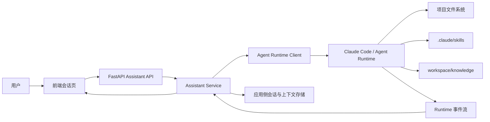

# ai-prd Assistant 迁移到 Agent Runtime 的设计方案

## 1. 文档信息

- 项目名称：ai-prd
- 文档名称：Assistant 迁移到 Agent Runtime 的设计方案
- 文档版本：V1.0
- 文档日期：2026-04-13
- 文档状态：草案

---

## 2. 背景

当前 `ai-prd` 后端已经具备以下基础能力：

- 应用级登录与会话鉴权
- AI 助手消息收发接口
- 历史会话持久化
- SSE 流式返回
- 前端会话页与登录页基础联调

但当前 AI 助手的执行内核仍然是“普通 LLM 调用”，而不是真正的 Agent Runtime。  
这意味着系统目前还不具备以下关键能力：

- 自动搜索代码和文件
- 自动调用工具并持续多轮推理
- 基于文件系统自动发现和加载 Skill
- Runtime 级会话恢复
- Runtime 级执行上下文管理

这与 `ai-prd` 的产品目标不一致。产品目标不是“一个普通问答接口”，而是“一个以会话为中心、可挂载上下文、可调用 Skill、可追溯执行过程的 AI 工作台”。

---

## 3. 现状判断

### 3.1 当前 ai-prd 的实现状态

当前 `source/backend/` 中的 Assistant 主要由以下模块组成：

- `app/api/assistant.py`：对话路由层
- `app/business/assistant/service.py`：应用级对话服务
- `app/business/assistant/store.py`：SQLite 会话与消息存储
- `app/integrations/llm/client.py`：普通模型客户端

这套实现适合作为“应用壳层”的起点，但不适合作为最终的 Agent 架构内核。

### 3.2 参考项目的可复用价值

参考项目已经提供了两类有价值的资产：

1. 基于 Anthropic Tool Use 的自定义 Agent 编排思路
2. `.claude/skills/` 目录下的真实 Skill 资源

但参考项目本身并不是 Claude Code SDK / Claude Agent SDK 方案。  
它的能力边界是：

- 已有：手写 `TOOL_REGISTRY`、手写工具执行分发、Anthropic Tool Use 循环
- 没有：真正的 Skill 自动发现、真正的 Runtime 会话恢复、真正的 Claude Code 运行时能力

因此，参考项目适合被当作“过渡资产来源”，不适合作为最终目标架构。

### 3.3 当前问题的本质

当前系统的主要问题不是“模型不够强”，而是“执行内核层次不对”。

如果继续沿着“FastAPI 内部手写 Tool Registry”的方向演进，将会持续出现以下问题：

- 后端重复实现 Agent Runtime 已经具备的能力
- Skill 体系与后端工具注册中心割裂
- 文件系统发现、权限边界、上下文恢复等能力无法自然统一
- 前后端可展示的业务事实与 Runtime 的执行事实难以稳定映射

---

## 4. 设计目标

本次迁移的目标不是重写整个产品，而是把当前 AI 助手升级为“应用层 + Runtime 层”双层架构。

本次迁移需要实现以下目标：

1. 让 Assistant 的执行内核切换为真正的 Agent Runtime
2. 支持 Runtime 自动调用工具、搜索文件、读取文件、调用 Skill
3. 保留当前 FastAPI 的登录、会话、业务状态和前端联调成果
4. 在应用层继续维护 `当前会话范围 / 本轮指定 / 已读取上下文 / 来源` 四层业务模型
5. 为后续知识库挂载、Skill 库展示、会话恢复和审计留出稳定接口

---

## 5. 非目标

本次迁移阶段不以以下事项为主要目标：

- 不在本阶段完成知识库索引系统
- 不在本阶段完成所有 Skill 的产品化管理 UI
- 不在本阶段完成所有业务对象的 citation 精细化展示
- 不在本阶段把所有参考项目工具全部迁移进来
- 不在本阶段做多 Runtime 并存调度

本阶段的重点是：先把执行内核从“普通聊天模型”切换为“真正的 Agent Runtime”。

---

## 6. 核心设计决策

### 6.1 总体决策

Assistant 的后端结构调整为两层：

- 应用层：保留在 FastAPI 中，负责用户、会话、上下文挂载、业务审计、前端展示协议
- Runtime 层：交由 Claude Code SDK / Claude Agent Runtime 承担，负责 Skill 发现、工具调用、文件搜索、会话恢复和执行环境管理

### 6.2 Runtime 优先级决策

本项目优先采用 Claude Code SDK / Claude Agent Runtime。

理由如下：

- 与 `Skill` 的文件系统发现机制天然契合
- 与产品文档中“SDK 负责会话恢复、工具调用、Skill 发现”的职责划分一致
- 最贴合本项目“围绕代码、文档、Skill、工作区上下文执行”的目标

### 6.3 技能目录决策

迁移第一阶段，项目级 Skill 目录采用 **项目根目录** `.claude/skills/`。

原因：

- 当前仓库已经存在 `.claude/skills/`
- Claude Runtime 默认对项目根目录下的 `.claude` 约定更自然
- 当前项目根目录同时承载 `.venv`、源码、工作区等资源，适合作为 Runtime 入口

说明：

- `source/` 仍然是主要应用源码目录
- `workspace/knowledge/` 仍然是知识对象承载目录
- Runtime 的项目根目录使用仓库根目录
- Runtime 的主要分析对象通过提示词、上下文和业务层约束引导到 `source/` 与 `workspace/knowledge/`

后续如需与更严格的目录规范对齐，可再单独做一次 Skill 目录迁移。

### 6.4 会话模型决策

应用层会话与 Runtime 会话分离建模。

应用层继续维护面向产品的会话：

- 用户是谁
- 会话标题是什么
- 前端展示哪些轮次
- 当前会话挂载了哪些上下文对象

同时，每个应用层会话关联一个 Runtime 会话标识：

- `runtime_provider`
- `runtime_session_id`
- `runtime_working_directory`

这样可以同时满足：

- 前端产品语义稳定
- Runtime 恢复能力可用
- 未来替换底层 Runtime 时，应用层接口不需要重写

---

## 7. 目标架构



### 7.1 应用层职责

应用层负责：

- 登录鉴权
- 应用级会话列表
- 应用级轮次记录
- 上下文挂载与恢复
- 将用户输入组装为 Runtime 输入
- 消费 Runtime 事件并抽取业务事实
- 向前端输出稳定的 SSE 协议

### 7.2 Runtime 层职责

Runtime 负责：

- 搜索文件
- 读取文件
- 执行工具
- 自动发现 Skill
- 维持 Runtime 级会话
- 生成最终回答
- 返回执行过程事件

---

## 8. 目录与模块设计

### 8.1 后端新增与调整目录

建议在 `source/backend/app/` 中新增以下目录：

```text
app/
├── api/
│   └── assistant.py
├── business/
│   └── assistant/
│       ├── service.py
│       ├── store.py
│       ├── runtime_mapper.py
│       └── citations.py
├── integrations/
│   └── agent_runtime/
│       ├── __init__.py
│       ├── base.py
│       ├── models.py
│       ├── claude_runtime.py
│       └── mock_runtime.py
└── schemas/
    └── assistant.py
```

### 8.2 现有模块处理建议

保留并重写：

- `app/api/assistant.py`
- `app/business/assistant/service.py`
- `app/business/assistant/store.py`

新增：

- `app/integrations/agent_runtime/`
- `app/business/assistant/runtime_mapper.py`

降级为过渡模块，后续可删除：

- `app/integrations/llm/client.py`

说明：

- 迁移完成后，不再让 `assistant` 路径直接依赖普通 LLM client
- 如其他业务仍有普通问答需求，可把 `llm/client.py` 保留给非 Agent 场景单独使用

---

## 9. 数据模型设计

### 9.1 Assistant Session

建议在当前 `assistant_sessions` 中新增以下字段：

| 字段 | 类型 | 说明 |
| --- | --- | --- |
| `runtime_provider` | TEXT | 底层 Runtime 类型，如 `claude_code` |
| `runtime_session_id` | TEXT | Runtime 返回的会话标识 |
| `runtime_working_directory` | TEXT | Runtime 启动时使用的工作目录 |
| `status` | TEXT | 会话状态，如 `active` / `archived` |

### 9.2 Assistant Turns

建议新增轮次级表：

| 字段 | 类型 | 说明 |
| --- | --- | --- |
| `turn_id` | TEXT | 轮次主键 |
| `session_id` | TEXT | 所属会话 |
| `user_message_id` | TEXT | 用户消息 ID |
| `assistant_message_id` | TEXT | 助手消息 ID |
| `started_at` | TEXT | 开始时间 |
| `completed_at` | TEXT | 完成时间 |
| `status` | TEXT | `running` / `completed` / `failed` |

### 9.3 四层上下文记录

建议新增四组表或逻辑等价结构：

1. `session_context_mounts`
2. `turn_context_requests`
3. `turn_context_usage`
4. `answer_citations`

各自职责：

- `session_context_mounts`：会话级长期范围
- `turn_context_requests`：本轮显式指定
- `turn_context_usage`：本轮实际读取
- `answer_citations`：最终回答引用

### 9.4 Runtime Event Log

建议新增 `assistant_runtime_events` 作为调试和审计辅助表。

可记录的事件类型包括：

- `tool_use`
- `tool_result`
- `file_search`
- `file_read`
- `skill_selected`
- `delta`
- `complete`
- `error`

该表不应直接作为前端展示模型，但应作为排障与审计依据。

---

## 10. Runtime Client 抽象设计

### 10.1 设计目标

后端不直接耦合具体 SDK，而是通过统一接口调用 Runtime。

### 10.2 推荐接口

建议抽象接口如下：

```python
class AgentRuntimeClient(Protocol):
    async def create_or_resume_session(
        self,
        *,
        runtime_session_id: str | None,
        working_directory: str,
        system_prompt: str,
    ) -> RuntimeSession:
        ...

    async def send_message_stream(
        self,
        *,
        session: RuntimeSession,
        message: str,
        metadata: dict[str, Any],
    ) -> AsyncIterator[RuntimeEvent]:
        ...

    async def list_available_skills(
        self,
        *,
        working_directory: str,
    ) -> list[RuntimeSkill]:
        ...
```

### 10.3 Runtime Event 统一协议

建议 Runtime 事件统一抽象为：

- `session`
- `tool_use`
- `tool_result`
- `skill_use`
- `search`
- `read`
- `delta`
- `message`
- `usage`
- `complete`
- `error`

FastAPI API 层只转发标准化后的事件，不直接暴露底层 SDK 的原始事件格式。

---

## 11. API 设计调整

### 11.1 保持兼容的接口

以下接口建议保留：

- `GET /api/assistant/sessions`
- `GET /api/assistant/sessions/{session_id}`
- `POST /api/assistant/chat`
- `POST /api/assistant/chat/stream`

### 11.2 推荐新增接口

建议新增：

- `GET /api/assistant/skills`
  - 返回当前项目可见的 Skill 列表
- `POST /api/assistant/sessions/{session_id}/mounts`
  - 管理会话级上下文挂载
- `GET /api/assistant/sessions/{session_id}/turns/{turn_id}/trace`
  - 返回轮次级执行轨迹

### 11.3 SSE 事件建议

前端最终应消费的 SSE 事件建议包含：

- `session`
- `turn_start`
- `activity`
- `delta`
- `tool_use`
- `tool_result`
- `skill_use`
- `citations`
- `complete`
- `error`

其中：

- `activity` 用于展示“正在检索需求文档”“正在搜索代码”等中间态
- `skill_use` 用于展示本轮启用的 Skill
- `citations` 用于在完成前或完成后补充证据

---

## 12. Skill 设计

### 12.1 技能目录

第一阶段采用：

```text
ai-prd/
└── .claude/
    └── skills/
```

### 12.2 技能来源

初始可用 Skill 建议来自两个来源：

1. 当前仓库已有的项目 Skill
2. 参考项目中已经沉淀完成、与 `ai-prd` 方向一致的 Skill

### 12.3 技能迁移建议

第一批建议迁入的 Skill 类型：

- 需求评审
- 测试点生成
- 代码影响分析
- 文档补全

不建议在第一阶段直接迁移所有参考项目 Skill。  
应该先迁移与 `ai-prd` 主工作流直接相关的 Skill。

### 12.4 产品层与 Runtime 层的边界

Runtime 负责：

- 发现 Skill
- 决定何时调用 Skill
- 将 Skill 作为执行能力的一部分使用

应用层负责：

- 展示哪些 Skill 对用户可见
- 控制哪些 Skill 可推荐
- 为 Skill 提供中文说明、适用场景和入口

---

## 13. 迁移阶段划分

### 阶段 1：接入 Runtime 抽象层

目标：

- 后端不再直接调用普通 LLM client
- 新增 `agent_runtime` 抽象
- 在本地先用 mock runtime 保持测试稳定

产出：

- `integrations/agent_runtime/`
- Runtime 事件标准结构
- `service.py` 改为依赖 Runtime Client

### 阶段 2：接入 Claude Runtime

目标：

- 用 Claude Code / Agent Runtime 替换 mock runtime
- 跑通真实 Skill 发现、文件搜索、文件读取
- 会话恢复打通

产出：

- `claude_runtime.py`
- `runtime_session_id` 持久化
- 流式事件透传

### 阶段 3：接入四层上下文记录

目标：

- 会话长期范围、本轮指定、已读取上下文、来源四层记录可落库
- 前端可展示结构化上下文信息

产出：

- `session_context_mounts`
- `turn_context_requests`
- `turn_context_usage`
- `answer_citations`

### 阶段 4：Skill 产品化与会话工作台增强

目标：

- 前端展示 Skill 列表与推荐
- 在会话中展示 Skill 使用记录
- 为知识对象挂载与上下文恢复提供更完整 UI

---

## 14. 测试与验证策略

### 14.1 单元测试

需要覆盖：

- 应用层会话创建与恢复
- Runtime 抽象层接口行为
- Runtime 事件到业务事件的映射
- 上下文记录写入逻辑

### 14.2 集成测试

需要覆盖：

- 登录后发起一次真实会话
- Runtime 自动搜索文件
- Runtime 自动读取文件
- Runtime 自动选择 Skill
- 会话重新进入时恢复历史

### 14.3 验收标准

本次迁移完成的最低验收标准如下：

1. 用户在前端发起一次会话时，Runtime 能自动搜索和读取项目文件
2. 项目级 `.claude/skills/` 中的 Skill 能被 Runtime 自动发现
3. 同一会话可在刷新页面后继续追问，并恢复 Runtime 会话
4. SSE 中可看到至少工具调用、Skill 使用、文本输出三类事件
5. 应用层仍然能够列出会话、查看历史、删除会话

---

## 15. 风险与应对

### 风险 1：SDK 接入复杂度高于预期

应对：

- 先做 `agent_runtime` 抽象层
- 先跑通 mock runtime，再接真实 runtime

### 风险 2：Runtime 原始事件与前端展示模型不一致

应对：

- 增加 `runtime_mapper.py`
- 所有前端事件都通过应用层标准化

### 风险 3：Skill 目录与当前仓库结构不一致

应对：

- 第一阶段明确采用项目根目录 `.claude/skills/`
- 后续如需改到 `source/.claude/skills/`，单独做目录迁移

### 风险 4：业务层上下文与 Runtime 上下文耦合混乱

应对：

- 应用层只维护四层业务事实
- Runtime 只负责执行，不负责反写长期上下文

---

## 16. 推荐实施顺序

建议严格按以下顺序推进：

1. 增加 `agent_runtime` 抽象目录与 mock runtime
2. 重写 `assistant/service.py`，切到 Runtime 抽象
3. 调整现有 SQLite schema，为 `runtime_session_id` 等字段预留空间
4. 接入真实 Claude Runtime
5. 把 `.claude/skills/` 中的项目 Skill 整理成首批可用技能
6. 增加 Runtime 事件映射与前端 SSE 展示
7. 再开始接入四层上下文记录

不建议先做四层上下文落库，再做 Runtime 切换。  
先把执行内核切对，后续上下文记录才有稳定的事实来源。

---

## 17. 结论

`ai-prd` 当前已经有了一个不错的应用层起点，但执行内核仍停留在“普通聊天后端”阶段。  
要实现真正的文件搜索、工具调用、Skill 发现和 Runtime 会话恢复，必须把 Assistant 迁移为“应用层 + Agent Runtime”双层结构。

本次方案的核心不是“把参考项目复制过来”，而是：

- 保留当前已做好的产品壳层
- 引入真正的 Agent Runtime
- 让 `.claude/skills/` 和 Runtime 会话真正成为一等能力
- 用应用层去承接产品所需的可展示、可恢复、可审计业务模型

这会是 `ai-prd` 从“会聊天的页面”升级为“可执行的 AI 工作台”的关键一步。
