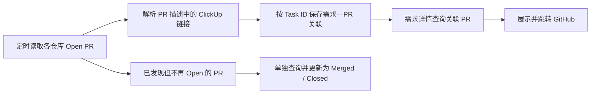

## 设计结论

采用“GitHub 定时轮询 + 本地反向索引”，不配置 Webhook。轮询只扫描 Open PR；创建后在首次扫描前就关闭的 PR 允许漏掉。



### 一、发现机制

复用现有代码 Review 项目配置中的：

- 仓库列表
- `github_access`
- `workspace_repo_path`
- 目标分支
- 轮询周期，默认5分钟

每轮处理顺序调整为：

1. 拉取仓库全部 Open PR。
2. 在 Reviewer、Draft、文件类型等代码 Review 过滤之前，先执行需求关联发现。
3. 从 PR 描述提取 `app.clickup.com/t/...` 和 `acme.clickup.com/t/...` 链接。
4. Draft PR 同样可以关联需求。
5. 完成关联同步后，再走原来的代码自动 Review 判断。

这样“需求关联”不会要求 PR 已指定 Reviewer，也不会产生额外的 PR 列表请求。

需要明确：不配置 Webhook，但仍需在项目配置中登记需要扫描的仓库，并保证 GitHub API Token 或 `gh_cli` 有读取权限。

仓库级配置中，`enabled` 控制是否创建自动代码 Review 任务，`pr_link_enabled` 控制是否同步需求—PR 关联。仅需关联监控的仓库应配置为 `enabled: false`、`pr_link_enabled: true`；未显式配置 `pr_link_enabled` 时，其值跟随 `enabled`。

### 二、关联规则

以 ClickUp Task ID 作为稳定需求标识，不存需求文件路径，因为需求文件可能改名或移动。

支持：

- 一个需求关联多个 PR。
- 一个 PR 同时关联多个需求。
- PR 描述后续增加、删除或替换需求链接。
- 重复链接自动去重。
- 多次轮询幂等，不产生重复记录。

每次扫描到 PR 时，采用“整体替换该 PR 当前关联”的方式：

- 新出现的 Task ID：新增。
- 仍然存在：更新 PR 信息。
- 已从 PR 描述移除：删除关联。
- 描述中不再包含任何需求链接：删除该 PR 的全部关联。

### 三、状态同步

数据库记录至少包含：

| 字段 | 说明 |
|---|---|
| `task_id` | ClickUp Task ID |
| `repo_full_name` | GitHub 仓库 |
| `pr_number` | PR 编号 |
| `pr_url` | PR 链接 |
| `title` | PR 标题 |
| `author_login` | 作者 |
| `state` | `draft/open/merged/closed` |
| `base_ref` | 目标分支 |
| `github_updated_at` | GitHub 更新时间 |
| `first_seen_at` | 首次发现时间 |
| `last_seen_at` | 最近同步时间 |

主键为：

```text
(task_id, repo_full_name, pr_number)
```

对于已经发现、上轮仍为 Open、但本轮不再出现在 Open 列表中的 PR，单独读取一次详情：

- 有 `merged_at`：更新为 `merged`。
- 没有 `merged_at`：更新为 `closed`。
- 读取失败：保留关联，显示为“状态未知”，等待下轮重试。

这不会补查从未发现过的 Closed PR，符合已确认的漏检边界。

### 四、查询接口

新增：

```http
GET /api/requirements/pull-requests?source_path=workspace/coinex/knowledge/requirements/tasks/xxx__86xxx.md
```

后端处理：

1. 校验路径属于当前需求知识库。
2. 从需求文件名或任务元信息提取 Task ID。
3. 排除 `_deleted` 下的需求。
4. 查询关联 PR。
5. 按 `Draft/Open → Merged → Closed`、更新时间倒序返回。

不修改通用知识文件读取接口，避免把 GitHub 逻辑耦合进所有知识库文件。

### 五、需求详情 UI

在需求正文上方、文件工具栏下方增加紧凑的“关联 PR”区域；没有关联时完全不显示。

示意：

```text
关联 PR · 2

example_backend #8784   优化合约下单逻辑        Open
coinex_web     #1256   调整下单面板展示        Merged
```

交互规则：

- 整行可点击，在新标签页打开 GitHub。
- 展示仓库简称、PR 编号、标题和状态。
- 作者等次要信息放在悬停提示中，不占正文空间。
- 移动端允许标题换行，每行保持至少 44px 点击区域。
- 使用现有暖色纸张视觉体系、温和边框和低饱和状态标签，不引入 GitHub 风格的高饱和色块。
- 查看“需求评审”时隐藏该区域，返回需求正文后恢复，避免与评审元信息混在一起。

### 六、验收标准

- Open PR 描述包含一个需求链接，下个轮询周期内在需求详情出现。
- 无 Reviewer、Draft PR 也能建立关联。
- 一个 PR 中的多个需求链接分别建立关联。
- 多个 PR 可以同时显示在同一需求下。
- 修改 PR 描述后，关联在下次轮询正确增删。
- 已发现的 PR 合并或关闭后，状态能够更新且链接继续保留。
- 重复轮询不产生重复数据。
- PR 创建并在首次轮询前关闭时允许漏检。
- GitHub 单仓库读取失败不影响其他仓库继续同步。

这个设计不需要 Webhook，也不把需求关联绑定到“是否触发代码 Review”的业务条件上。下一步可按此设计进入实现。
