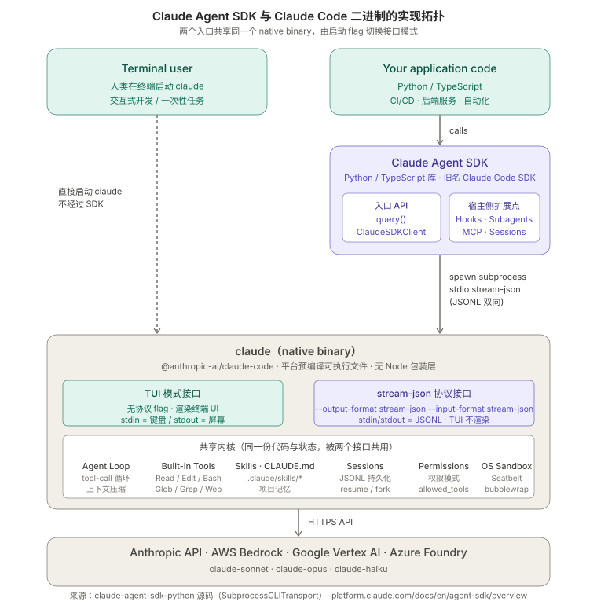
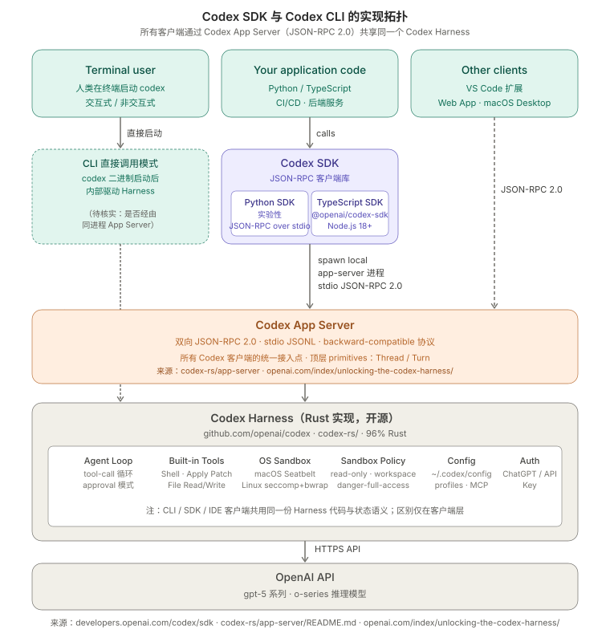

# 两大主流 agent SDK 和 CLI 实现的比较

## 1\. 文档信息
*   文档版本：V1.0
*   文档日期：2026-05-08
* * *

## 2\. 背景

目前有两个主要产品线：Anthropic 的 Claude Code（CLI 与 Claude Agent SDK）和 OpenAI 的 Codex（CLI 与 Codex SDK）。两条线的"SDK 与 CLI 之间的关系"在架构上有本质差异，**直接影响安装方式、协议层、升级策略、进程模型与多客户端共享能力**。

本文档聚焦 SDK ↔ CLI 关系。OS 级沙箱机制与 sandbox 适用范围见 [两大主流 agent 沙箱模式的实现机制](./两大主流%20agent%20沙箱模式的实现机制.md)。

注意：OpenAI 同时提供两条 SDK 产品线——**Codex SDK**（控制 Codex CLI，本文档主体）与 **OpenAI Agents SDK**（升级版通用 agent 框架，独立产品，不在本文展开）。

## 3\. 信息来源

**Anthropic**

| 来源 | URL |
| ---| --- |
| Claude Agent SDK Overview | [https://code.claude.com/docs/en/agent-sdk/overview](https://code.claude.com/docs/en/agent-sdk/overview) |
| Python SDK README | [https://github.com/anthropics/claude-agent-sdk-python/blob/main/README.md](https://github.com/anthropics/claude-agent-sdk-python/blob/main/README.md) |
| 源码：`subprocess_cli.py` | [https://github.com/anthropics/claude-agent-sdk-python/blob/main/src/claude\_agent\_sdk/\_internal/transport/subprocess\_cli.py](https://github.com/anthropics/claude-agent-sdk-python/blob/main/src/claude_agent_sdk/_internal/transport/subprocess_cli.py) |
| 源码：`client.py`（ClaudeSDKClient） | [https://github.com/anthropics/claude-agent-sdk-python/blob/main/src/claude\_agent\_sdk/client.py](https://github.com/anthropics/claude-agent-sdk-python/blob/main/src/claude_agent_sdk/client.py) |
| 源码：`_internal/client.py`（InternalClient） | [https://github.com/anthropics/claude-agent-sdk-python/blob/main/src/claude\_agent\_sdk/\_internal/client.py](https://github.com/anthropics/claude-agent-sdk-python/blob/main/src/claude_agent_sdk/_internal/client.py) |

**OpenAI Codex**

| 来源 | URL |
| ---| --- |
| Codex SDK 官方文档 | [https://developers.openai.com/codex/sdk](https://developers.openai.com/codex/sdk) |
| Codex App Server 文档 | [https://developers.openai.com/codex/app-server](https://developers.openai.com/codex/app-server) |
| Codex 仓库 README | [https://github.com/openai/codex/blob/main/README.md](https://github.com/openai/codex/blob/main/README.md) |
| Codex Python SDK README | [https://github.com/openai/codex/blob/main/sdk/python/README.md](https://github.com/openai/codex/blob/main/sdk/python/README.md) |
| Codex App Server 源码 README | [https://github.com/openai/codex/blob/main/codex-rs/app-server/README.md](https://github.com/openai/codex/blob/main/codex-rs/app-server/README.md) |
| 博客：Unlocking the Codex harness | [https://openai.com/index/unlocking-the-codex-harness/](https://openai.com/index/unlocking-the-codex-harness/) |

* * *

## 4\. 总览对比

| 维度 | Anthropic（Claude Code + Claude Agent SDK） | OpenAI（Codex CLI + Codex SDK） |
| ---| ---| --- |
| CLI 实现语言 | TypeScript，编译为 native binary（Bun-class single executable） | Rust |
| CLI 是否开源 | 否（二进制分发） | 是（[github.com/openai/codex）](http://github.com/openai/codex）) |
| SDK 与 binary 的关系 | SDK 自带 binary（npm/pip 包安装即用） | SDK 不带 binary，需要先单独安装 codex |
| 协议 | stream-json（事件流式 JSONL over stdio） | JSON-RPC 2.0（标准 RPC，over stdio JSONL） |
| 架构中间层 | 无；SDK 直接是 binary 的协议客户端 | 有：Codex App Server 作为统一接入点 |
| 顶层抽象 | session\_id / messages | Thread / Turn |
| 多客户端共享 | 单客户端：SDK = binary 的协议客户端 | 多客户端：CLI / SDK / VS Code / Web / macOS 共用 App Server |
| 协议向后兼容承诺 | 未明确公开承诺 | 公开承诺向后兼容 |
| 语言绑定 | Python、TypeScript（同步发布） | Python（实验性）、TypeScript |

* * *

## 5\. 架构拓扑
#### Anthropic：


*       *   `claude` native binary 既是 CLI 也是 SDK 的子进程；同一个二进制按 flag 切换 TUI / stream-json 模式。

#### OpenAI



*       *   所有客户端（CLI、SDK、VS Code、Web、macOS）都是 Codex App Server 的 JSON-RPC 客户端，App Server 驱动 Codex Harness。

把两张图并排看，本质差别不是"二进制 vs 库"，而是**有没有协议中间层**。Anthropic 把 binary 直接当作协议端点；OpenAI 在 binary 内部抽象出一个独立的 App Server 接口，所有客户端共享。

* * *

## 6\. 安装与分发（关键差异）

这是两条产品线工程接入路径上**最直观的差异**，单独成节。

### 6.1 Anthropic：SDK 自带 binary，开箱即用

| 路径 | 命令 | 结果 |
| ---| ---| --- |
| TypeScript SDK | `npm install @anthropic-ai/claude-agent-sdk` | 通过平台相关的 optional dependency 自动拉取对应平台的 native binary（macOS arm64 / Linux x64 等），SDK 包内即包含可执行的 `claude` |
| Python SDK | `pip install claude-agent-sdk` | 包内同样捆绑 native binary，README 原文："The Claude Code CLI is automatically bundled with the package - no separate installation required! The SDK will use the bundled CLI by default." |
| 独立安装 CLI（可选） | `curl -fsSL https://claude.ai/install.sh | bash` | 把 `claude` 装到系统 PATH，独立于任何 SDK |
| SDK 切换到独立安装的 CLI | `ClaudeAgentOptions(cli_path="/path/to/claude")` | 默认用 SDK 内捆绑版；可显式覆盖 |

工程含义：

*   **新机器只** **`npm install`** **或** **`pip install`** **一条命令就能开始用**，CI/Docker 镜像不需要额外步骤。
*   SDK 的版本 = 捆绑 binary 的版本，**强绑定**；想升级 binary 必须升 SDK 包（除非用 `cli_path` 接管）。
*   同一台机器上 SDK 内捆绑版与独立安装版可能版本不一致；后端服务默认用前者时，运维侧的 `claude` 升级不会自动反映到服务上。

### 6.2 OpenAI：SDK 与 CLI 完全分离，必须分别安装

| 路径 | 命令 | 结果 |
| ---| ---| --- |
| 安装 codex CLI（必需） | `npm install -g @openai/codex` 或 `brew install --cask codex` 或从 GitHub Releases 下载预编译二进制（`codex-aarch64-apple-darwin.tar.gz` 等）解压重命名为 `codex` | 系统 PATH 上得到 `codex` 二进制 |
| TypeScript SDK | `npm install @openai/codex-sdk` | 仅安装 SDK 库；不包含 codex 二进制 |
| Python SDK | `cd sdk/python && python -m pip install -e .`（需先 clone Codex 仓库） | 仅安装 SDK 库；不包含 codex 二进制；目前还是实验性，未发布到 PyPI |
| SDK 指向 binary | `AppServerConfig(codex_bin=...)` 显式指向本地 codex 路径 | SDK 通过此路径 spawn `codex app-server` 子进程，建立 JSON-RPC 通道 |

工程含义：

*   **新机器至少需要两步**：先装 codex 再装 SDK，CI/Docker 镜像必须把这两步都写进去。
*   SDK 与 binary 解耦，**版本独立升级**：可以只升 SDK 而保留旧 codex，反之亦然——只要协议向后兼容。
*   独立分发的 codex 二进制是同一份代码（开源 Rust 编译产物），不存在 SDK 内/外两个不同版本的问题。
*   Python SDK 当前还需要从仓库本地安装，**不适合直接进入 ai-prd 生产依赖**，得等正式发布到 PyPI 后再考虑。

### 6.3 安装方式对运维的实际影响

| 场景 | Anthropic | OpenAI |
| ---| ---| --- |
| 本地开发新员工上手 | 一条 install | 两条 install + 验证 PATH |
| Docker 镜像构建 | `pip install` 即可 | 必须显式 `npm i -g @openai/codex` 或下载 release tar 解压 |
| 离线/受限网络环境 | 需要镜像 npm/pypi（含平台 binary 子包） | 需要镜像 npm/pypi + 单独镜像 codex GitHub Releases |
| binary 安全审计 | 闭源二进制，只能审计 SDK 源码 | binary 与 SDK 都开源，可完整审计或自编译 |
| 多团队共享同版本 binary | 不直接支持，需统一 SDK 版本 | 直接支持，安装一次系统级 codex 多服务共享 |

* * *

## 7\. 协议层对比

### 7.1 Anthropic：stream-json（事件流式 JSONL）

启动命令：`claude --output-format stream-json --input-format stream-json --verbose`。

通信形态：

*   stdio JSONL，每行一个事件（消息、tool\_use、tool\_result、result 等）。
*   不是 RPC：没有 `method` / `id` / `params` 这种结构；客户端按事件类型分发。
*   协议规范没有公开版本号；稳定性靠 SDK 版本绑定保障（详见 §6.1）。
*   错误以 stderr / 进程退出 / 特定事件类型反馈，由 SDK 转换为 `CLINotFoundError` / `CLIConnectionError` / `ProcessError` / `CLIJSONDecodeError`。

### 7.2 OpenAI：JSON-RPC 2.0

启动命令：`codex app-server`（典型用法；具体由 SDK 内部决定）。

通信形态：

*   stdio JSONL，**每行一个 JSON-RPC 2.0 消息**（含 `jsonrpc: "2.0"`、`method`、`params`、`id` 等标准字段）。
*   双向：服务端可主动向客户端发请求或通知（典型用法：approval 询问、状态推送）。
*   **明确承诺向后兼容**：旧客户端可以与新版本服务端通信。
*   顶层 primitives：`Thread`（一次会话）→ `Turn`（一来一回）。
*   错误使用 JSON-RPC 标准错误码体系。
*   同一协议被官方多客户端复用（CLI / SDK / VS Code / Web / macOS Desktop），事实上是稳定 API。

### 7.3 协议差异的工程含义

| 维度 | stream-json | JSON-RPC 2.0 |
| ---| ---| --- |
| 调试工具 | 需按 SDK 源码理解事件类型 | 标准 RPC 工具链可用 |
| 自定义客户端 | 需读 SDK 实现 | 有 schema generation（TypeScript + JSON Schema），可自动生成绑定 |
| 服务端崩溃语义 | 子进程退出 | 标准 RPC 连接中断，可定义重连/重试 |

会话恢复机制属于进程模型范畴，详见 §10。
* * *

## 8\. 版本绑定与升级路径

| 维度 | Anthropic | OpenAI |
| ---| ---| --- |
| binary 升级触发点 | 升级 SDK 包版本 | 独立升级 codex（npm/brew/release） |
| 协议变更影响 | 升级 SDK 时 binary 同步换，规避协议错配 | 协议向后兼容承诺降低错配风险，但 SDK 更新仍可能引入新 method |
| 回滚能力 | SDK 与 binary 同包，回滚原子化 | SDK 与 binary 各自回滚，组合空间更大但需要测试矩阵 |
| 多服务一致性 | 必须统一 SDK 版本 | 可统一 codex 版本而 SDK 各自演进 |

* * *

## 9\. 多客户端共享能力

Anthropic 的 stream-json 是"一会话一进程"模式：子进程状态不被其他客户端共享。

OpenAI 的 App Server 是公开协议中间层：一个长驻 `codex app-server` 理论上可同时接受多个客户端连接（CLI、SDK、IDE 扩展），共享同一份 Thread/Turn 状态。这是 Anthropic 模式下不存在的能力——若未来需要"前端 Web 与后端服务共享同一会话"，OpenAI 模型天然支持，Anthropic 模型需自行实现状态广播层。
* * *

## 10\. 进程管理与生命周期

[agent-sdk-process-model](./graphs/agent-sdk-process-model.svg)


### 10.1 Anthropic：子进程粒度（一会话一进程）

来源：`anthropics/claude-agent-sdk-python` 的 `_internal/client.py`、[`client.py`](http://client.py)、`_internal/transport/subprocess_cli.py`。

两个入口对应两种生命周期：

#### 10.1.1 `query()` —— 一次调用一个子进程

```rust
async def query(*, prompt, options=None, transport=None) -> AsyncIterator[Message]:
    client = InternalClient()
    async for message in client.process_query(...):
        yield message
```

*   **每次调用** **`query()`** **都新建一个** **`SubprocessCLITransport`** **实例并 spawn 一个** **`claude`** **子进程**。生成器结束、调用方 break、或异常发生时，嵌套 `try/finally` 触发 `await query.close()` 关进程，再清理 `materialize_resume_session` 写入的临时 `CLAUDE_CONFIG_DIR`。
*   没有进程池，不复用前次的子进程。
*   多轮上下文复用通过 `options.resume=session_id` 实现：**新拉起一个子进程**，让它从 session store 加载历史状态，而不是连回原进程。
*   结束行为：`SubprocessCLITransport.close()` 优雅关闭，5 秒超时后强制终止。

#### 10.1.2 `ClaudeSDKClient` —— 长驻子进程跨多轮

```python
async with ClaudeSDKClient(options=opts) as client:
    await client.query("first turn")
    async for msg in client.receive_response(): ...
    await client.query("second turn")  # 同一子进程
    async for msg in client.receive_response(): ...
```

*   `connect()` 时 spawn 一个子进程，整个 client 实例期间**长驻同一个** **`claude`** **进程**。
*   支持运行中控制：`interrupt()`（中断当前生成）、`set_permission_mode()`、`set_model()`，全部走 stream-json 协议指令。
*   强制 streaming 模式：`is_streaming_mode=True`，`interrupt()` 仅在此模式有效。
*   **限制**：v0.0.20 起，单个 `ClaudeSDKClient` 实例不能跨不同的 async runtime 上下文（不同 trio nursery / asyncio task group）使用，因为它内部维护一个跨 `connect()`→`disconnect()` 的持久 anyio task group。
*   `disconnect()` 或 `__aexit__` 关进程。

### 10.2 OpenAI：长驻 server 粒度（一 server 多 Thread）

来源：`openai/codex` 仓库 `sdk/python/README.md` 与 `src/codex_app_server/`。

```css
with Codex() as codex:
    t1 = codex.thread_start(model="gpt-5")
    r1 = t1.run("first thread, first turn")
    r2 = t1.run("first thread, second turn")
    t2 = codex.thread_start(model="gpt-5")  # 同一 server 上的第二个 Thread
    r3 = t2.run("second thread")
```

*   **`Codex()`** **构造函数 eager 启动 app-server 进程并执行 initialize 握手**；官方原文："`Codex()` is eager and performs startup + initialize in the constructor"。
*   **同一个 app-server 进程内可以创建多个 Thread**（`codex.thread_start(...)`），Thread 之间状态隔离但共享 server 进程。
*   Thread 内可调多次 `run()` 或 `turn()`，每次是 server 上的一次 JSON-RPC 请求。
*   退出由 `with` 上下文管理器保证；官方原文："Use context managers (`with Codex() as codex:`) to ensure shutdown"。
*   提供 `codex_app_server.retry.retry_on_overload` 用于过载场景重试。

### 10.3 进程粒度与失败模式对比

_此文档由 claude 完成初稿，所以对比有点倾向性，注意识别。_

| 维度 | Anthropic | OpenAI |
| ---| ---| --- |
| 进程数 = 会话数？ | 是（子进程粒度 = 会话粒度） | 否（一 server 承载多 Thread） |
| N 路并发会话的进程占用 | N 个 `claude` 子进程 | 1 个 app-server |
| 启动开销 | 每会话付一次 | server 摊销给所有 Thread |
| 状态隔离 | 进程级，天然安全 | 进程内 Thread 隔离，依赖 server 实现 |
| 单会话崩溃影响域 | 仅当前子进程 | server 崩溃影响全部 Thread |
| 上下文恢复 | `resume=session_id` 拉新进程从 store 重建 | server 内 Thread 内置持续；server 崩溃后需外部重建 |
| 控制接口 | `interrupt()` / `set_permission_mode()` / `set_model()` | `thread.turn()` 流式与中断 |
| async runtime 兼容 | `ClaudeSDKClient` 强约束（不能跨 nursery / task group） | 文档未明确约束（待 PoC 验证） |
| 优雅关闭 | `transport.close()` 5 秒超时后 SIGKILL | context manager 退出触发 shutdown |
| 异常路径清理 | 嵌套 `try/finally` 保证进程关闭与临时目录清理 | 依赖 `with` 块；未正确使用风险更大 |
| 过载重试 helper | 无官方 helper | `retry.retry_on_overload` 内置 |

* * *

## 11\. 对三方应用的工程影响

综合 §6–§10 得到选型决策对照表：

| 决策点 | Anthropic | OpenAI |
| ---| ---| --- |
| 安装 | 单步 `pip install` | 双步：先装 codex 再装 SDK |
| 后端进程模型 | 每会话拉子进程，宿主无长驻 binary | 可拉长驻 app-server，多会话复用 |
| 协议稳定性预期 | 无公开兼容承诺，靠 SDK 与 binary 同版本捆绑 | 公开承诺 JSON-RPC 向后兼容 |
| 多端协同（未来） | 需自实现状态广播 | 天然支持 |
| 安全审计与自编译 | 闭源二进制，仅可审计 SDK 源码 | binary 与 SDK 全开源 |
| 第三方模型接入 | 支持 | 支持 |

* * *

## 12\. 待验证问题

以下事项尚待确认：

1. **Codex Python SDK 是否已发布到 PyPI**：当前文档只给出 `cd sdk/python && pip install -e .`，意味着是开发期安装。生产可用的 PyPI 包发布时间表未知。（尽管源码里有配置 \` [https://github.com/openai/codex/blob/main/sdk/python/pyproject.toml](https://github.com/openai/codex/blob/main/sdk/python/pyproject.toml)\`，但 PyPI 上确实没有搜到： [https://pypi.org/org/openai/](https://pypi.org/org/openai/)）
2. **Codex TypeScript SDK 与 App Server 的关系**：官方文档明确说 Python SDK 走 JSON-RPC 控制 app-server，但 TypeScript SDK 描述只说 "control Codex from within your application"，未明确是否同样走 app-server。需查 SDK 源码或 PoC 验证。
3. **App Server 长驻多客户端连接的实际行为**：是否支持 N:1 客户端共享同一个 server 进程，还是单连接独占。
4. **Anthropic SDK 在 Linux 容器中的 native binary 表现**：musl vs glibc、容器内 sandbox 行为、headless 环境行为。
5. **Codex CLI 升级与 SDK 协议错配的实际容忍度**："向后兼容"承诺在多大版本跨度上仍成立。
6. **Codex** **`Codex()`** **实例的线程安全性**：是否可在 FastAPI 多 worker / 多请求间作为全局单例长驻、并发 `thread_start()` 的边界。
7. **Anthropic** **`ClaudeSDKClient`** **在 FastAPI 异步生命周期中的承载方式**：anyio task group 与每请求 / 每 worker 的对应关系，长会话场景下连接保活策略。
* * *