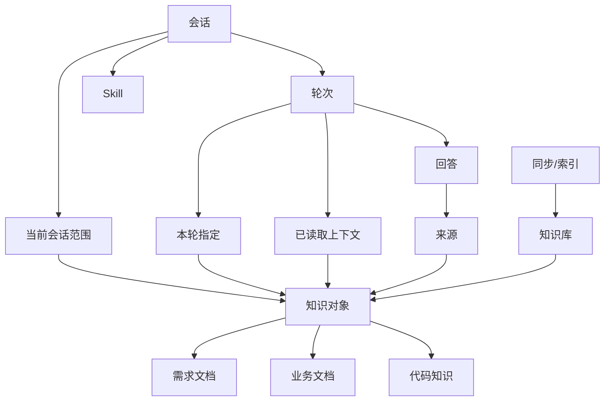

# ai-prd 产品定义与核心概念模型

## 1. 文档信息

- 项目名称：ai-prd
- 文档名称：产品定义与核心概念模型
- 文档版本：V1.0
- 文档日期：2026-04-13
- 文档状态：草案

---

## 2. 产品定义

### 2.1 产品定位

`ai-prd` 是一个以 AI 助手会话为核心入口的轻量产品工具，用来把**需求文档、业务文档和代码知识**连接到同一条分析链路中，帮助产品、研发和协作方围绕同一个问题快速形成结论、依据和下一步动作，并逐步沉淀可复用的业务概念、规则结构和关系模型。

它不是传统意义上的“文档管理系统”，也不是把多个模块并列摆放的“功能工作台”。  
它更像一个围绕问题求解组织的 AI 工作界面：

- 用户先进入会话，再围绕问题逐步补充上下文
- 知识库负责提供可浏览、可挂载、可追溯的知识对象
- Skill 负责提供结构化的分析能力与输出模板
- 系统负责记录这次会话用了哪些上下文、实际读取了什么、最终结论依据了什么
- 系统也需要把来自需求文档、业务文档和代码的稳定概念逐步归纳为可复用的业务模型资产

### 2.2 一句话说明

`ai-prd` 用 AI 会话把需求、业务规则和代码实现拉到同一个上下文里，帮助团队更快完成需求理解、规则澄清、测试点生成、代码影响分析，并沉淀跨资料源可复用的业务模型认知。

### 2.3 核心价值

- 降低跨资料源切换成本：不再在需求平台、文档库、代码仓之间来回跳转
- 提高分析一致性：让需求、规则和代码在同一轮问题中被同时考虑
- 提供可追溯结论：结论不是黑盒输出，用户可以看到实际读取上下文与最终来源
- 把能力产品化：通过 Skill 把常见分析任务沉淀为可复用的输出方式
- 沉淀可复用业务模型：从需求文档、业务文档和代码实现中持续提炼稳定概念、规则口径与关系结构

### 2.4 非目标

当前产品定义中，`ai-prd` 不以以下目标为核心：

- 不以“仅从代码中抽取并单独构建一套抽象业务模型体系”作为唯一主目标
- 不以“管理海量后台配置和复杂流程审批”作为主工作台
- 不把知识库做成脱离会话的独立内容消费产品
- 不把 Skill 做成与知识库、会话并列竞争的独立主入口系统

需要强调的是，“业务模型沉淀”依然是产品目标之一，只是它不再被定义为一个脱离会话与知识使用场景的独立系统目标，而是作为会话分析、知识关联和多源理解过程中的持续产物存在；其数据来源也不再局限于代码，而是同时来自需求文档、业务文档和代码知识。

---

## 3. 产品要解决的问题

在需求评审、规则澄清、测试设计和影响分析场景里，团队经常面对以下问题：

- 需求文档描述的是目标和验收，但缺少稳定规则背景
- 业务文档描述的是规则和术语，但缺少具体需求上下文
- 代码知识描述的是实现现状，但缺少产品意图和业务边界
- 同一个问题往往需要同时查看三类信息，但当前协作方式分散、跳转多、对齐慢
- AI 虽然能回答问题，但常常缺少明确的上下文边界与证据追溯

因此，`ai-prd` 的核心任务不是“多存一份资料”，而是提供一套围绕问题求解的产品机制，让用户可以：

1. 明确当前问题工作在哪些范围内
2. 直接把相关知识对象挂进会话
3. 使用适合任务的 Skill 获得更稳定的输出结构
4. 理解系统实际读取了什么，以及回答依据是什么
5. 在持续使用过程中，把跨资料源反复出现的稳定业务概念和关系逐步沉淀下来

---

## 4. 目标用户与使用场景

### 4.1 目标用户

- 产品经理：评审需求、补规则、查验收口径
- 研发工程师：理解规则背景、定位受影响模块、分析改动面
- 测试工程师：生成测试点、补边界条件、核对状态流转
- 跨职能协作者：在评审会、联调和回归阶段快速对齐结论

### 4.2 典型场景

- 基于某份需求文档发起需求评审
- 基于某份业务规则文档澄清边界和术语
- 基于某段代码范围分析模块影响和回归风险
- 在默认 AI 会话中自由提问，再逐轮补充具体上下文
- 从 Skill 页直接进入“需求评审”“测试点生成”“代码影响分析”等结构化任务

---

## 5. 产品范围与整体结构

`ai-prd` 从产品视角可以拆成四个协同层：

### 5.1 AI 助手

AI 助手是默认入口，也是产品最核心的使用界面。

职责包括：

- 接收用户问题与追问
- 承载当前会话范围
- 展示本轮指定、已读取上下文和来源
- 组织 Skill、知识对象与回答结果的关系

### 5.2 知识库

知识库不是孤立内容中心，而是会话的上下文供给层。

它负责承载三类核心知识对象：

- 需求文档
- 业务文档
- 代码知识

这三类对象都可以被浏览、预览、关联，并作为上下文发起新会话或带入当前会话。

### 5.3 Skill

Skill 是能力组织方式，不是第四类知识对象。

它负责定义：

- 适用场景
- 默认输入建议
- 输出结构
- 分析顺序与表达方式

Skill 的价值在于把“如何回答这类问题”沉淀为稳定模板，而不是替代知识本身。

### 5.4 运行记录与可追溯机制

系统需要把“会话正在看什么”“这一轮要求看什么”“实际上打开了什么”“最终依据了什么”区分开来，形成一套可展示、可恢复、可审计的记录机制。

---

## 6. 核心业务概念

本节定义 `ai-prd` 中最重要的业务概念，以及每个概念在产品中的职责。

### 6.1 会话

会话是用户围绕某个问题持续推进的一段工作上下文，也是产品的主容器。

会话的特点：

- 有自己的历史消息
- 可以长期挂载上下文范围
- 可以在多轮追问中保持任务连续性
- 可以带有当前激活的 Skill 或推荐 Skill

会话回答的是：**“我们正在围绕什么问题持续工作？”**

### 6.2 轮次

轮次是会话中的一次提问与一次回答。

轮次的特点：

- 每一轮都可以新增显式指定对象
- 每一轮都可能触发新的上下文读取
- 每一轮都可能产生新的证据引用

轮次回答的是：**“这一轮具体让系统做了什么？”**

### 6.3 知识对象

知识对象是可以被浏览、挂载、读取和引用的内容单元。

在当前产品中，知识对象只保留三类：

- 需求文档
- 业务文档
- 代码知识

这三类对象构成 AI 分析的主要知识输入面。

#### 6.3.1 需求文档

需求文档用于描述目标、范围、规则变更、验收要求和场景约束。

它回答的问题通常是：

- 这次要做什么
- 业务目标是什么
- 验收口径是什么
- 还有哪些规则没有补全

#### 6.3.2 业务文档

业务文档用于沉淀跨需求复用的长期规则、状态机、术语和边界口径。

它回答的问题通常是：

- 这个业务域本来的规则是什么
- 状态如何流转
- 异常和补偿如何定义
- 术语和口径是否一致

#### 6.3.3 代码知识

代码知识用于表达仓库、分支、路径范围、关键文件和索引结果。

它回答的问题通常是：

- 当前实现在哪里
- 哪些模块和接口可能受影响
- 状态机和关键逻辑是如何落地的
- 哪些文件适合作为分析入口

### 6.4 Skill

Skill 是 AI 的任务能力模板，用来规定某类任务更适合怎样组织输入和输出。

在当前产品语义中，Skill 不是知识本身，而是“分析方法”。

典型 Skill 包括：

- 需求评审
- 测试点生成
- 代码影响分析

Skill 回答的是：**“面对这类任务，AI 应该按什么结构输出结果？”**

### 6.5 当前会话范围

当前会话范围是会话级的长期上下文挂载结果，表示这场会话默认在哪些粗粒度范围内工作。

它通常表现为：

- 某个业务域
- 某组业务规则
- 某个代码仓 / 分支
- 某个路径范围
- 某个被长期挂载的需求对象

这层信息回答的是：**“这场会话长期默认看哪里？”**

### 6.6 本轮指定

本轮指定是轮次级的显式输入，表示用户这一轮明确要求系统带入哪些对象。

来源包括：

- 手动 `@` 某个对象
- 页面中主动选择某个对象
- 从某个知识对象详情页发起会话时自动注入的显式对象

这层信息回答的是：**“用户这一次明确点名要看什么？”**

### 6.7 已读取上下文

已读取上下文是轮次级执行记录，表示系统为了回答当前问题，实际读取了哪些对象或范围。

它可能包含：

- 用户显式指定的对象
- 会话长期范围内被真正读取的对象
- AI 在执行过程中推导出的额外读取范围

这层信息回答的是：**“系统这一次实际打开并使用了什么？”**

### 6.8 来源

来源是回答级证据，表示最终结论具体依据了哪些最小证据单元。

来源应尽量落到可核对的粒度，例如：

- 某份 PRD 的具体章节
- 某份业务规则文档的具体段落
- 某个代码文件的具体片段或关键实现

这层信息回答的是：**“这句结论具体根据什么得出？”**

### 6.9 挂载

挂载是把某个知识对象或范围加入会话的动作。

挂载的意义不是“立即展开所有内容”，而是把它声明为当前问题可被优先使用的上下文。

### 6.10 同步

同步是把外部需求源或文档源的内容引入知识库的过程。

同步强调：

- 保留原始来源
- 保留更新时间和维护元信息
- 让对象进入可浏览、可挂载、可检索状态

### 6.11 索引

索引主要用于代码知识场景，指系统对代码范围进行结构化抽取和整理的过程。

索引结果通常包括：

- 仓库、分支、路径范围
- 关键文件
- 关键符号或模块
- 适合在会话中继续深入分析的对象

---

## 7. 核心概念之间的关系

### 7.1 关系总览

可以把 `ai-prd` 理解为一个以“会话”为中心的关系网络：

### 7.2 关键关系说明

- 会话包含多个轮次，轮次构成会话中的持续对话过程
- 会话拥有自己的当前会话范围，决定长期默认工作边界
- 会话可以挂载一个或多个 Skill，用来影响回答方式和输出结构
- 本轮指定属于轮次，不属于整个会话的永久状态
- 已读取上下文属于执行事实，表示系统真实读取过的对象
- 来源属于回答级证据，应该比“已读取上下文”更接近最小依据单元
- 知识库提供三类知识对象，供会话挂载、轮次读取和回答引用
- 同步与索引负责把外部内容变成知识库中可用的对象

### 7.3 四层上下文关系

产品中必须严格区分以下四层：

1. 当前会话范围
2. 本轮指定
3. 已读取上下文
4. 来源

它们的关系不是包含替代关系，而是不同层级的业务事实：

- 当前会话范围不等于本轮指定
- 本轮指定不等于已读取上下文
- 已读取上下文不等于最终来源
- AI 推导出的读取范围不能自动升级为长期会话范围

换句话说，某个对象可能：

- 长期属于当前会话范围，但这一轮没有被读取
- 是本轮指定对象，但最终没有真正用到
- 被系统读取过，但没有出现在最终来源里
- 只作为一条最终来源出现，但并不代表它已经成为长期会话范围

---

## 8. 主要业务流程

### 8.1 默认会话流程

1. 用户进入 AI 助手页
2. 系统展示当前会话范围
3. 用户输入问题，并可通过 `@` 或页面操作指定对象
4. 系统记录本轮指定
5. 系统结合会话范围、显式指定和 Skill 组装候选上下文
6. AI 读取所需知识对象并生成回答
7. 系统记录已读取上下文与来源
8. 用户继续追问，形成下一轮

### 8.2 从知识对象发起会话

1. 用户在知识库中浏览某个需求文档、业务文档或代码对象
2. 在详情区点击“基于该对象发起会话”
3. 系统创建新会话，并自动挂载当前对象
4. 系统可按关联关系补充推荐的业务文档、代码范围或 Skill
5. 用户直接进入问题求解状态

### 8.3 从 Skill 发起会话

1. 用户在 Skill 页选择某个 Skill
2. 系统创建新会话，并挂载该 Skill
3. 系统可补充推荐知识对象
4. 用户围绕 Skill 的目标输出继续提问

---

## 9. 产品信息架构原则

根据当前原型与设计文档，`ai-prd` 的信息架构应坚持以下原则：

- AI 助手是默认入口，不把知识库和 Skill 做成并列主工作台
- 知识库围绕三类真实对象组织，而不是先给抽象分类卡片
- Skill 负责能力模板，知识库负责上下文对象，二者职责分离
- 界面优先展示问题、结论和下一步动作，而不是先展示标签墙
- 上下文信息必须分层展示，避免长期范围、本轮指定、读取记录和来源混在一起
- 证据默认后置，按需展开，不干扰主阅读路径

---

## 10. 推荐的产品业务模型

为了保证前后端表达一致，建议从产品视角采用以下业务模型：

### 10.1 核心实体

- 会话
- 轮次
- 知识对象
- Skill
- 会话挂载关系
- 轮次请求关系
- 轮次使用记录
- 回答引用记录

### 10.2 推荐映射

| 产品概念 | 建议业务记录 | 含义 |
| --- | --- | --- |
| 当前会话范围 | `session_context_mounts` | 会话级长期挂载关系 |
| 本轮指定 | `turn_context_requests` | 本轮显式指定对象 |
| 已读取上下文 | `turn_context_usage` | 本轮实际读取记录 |
| 来源 | `answer_citations` | 回答级证据引用 |

这组模型的意义在于：

- 能支撑页面展示
- 能支撑会话恢复
- 能支撑后续审计与调试
- 能避免把模型自由生成的描述误当成产品事实

---

## 11. 当前产品结论

综合页面原型和设计文档，`ai-prd` 当前应被定义为：

> 一个以 AI 助手为默认入口、以需求文档/业务文档/代码知识为核心上下文、以 Skill 为能力模板、以可追溯上下文和证据为可信机制的轻量 AI 产品工具。

它的本质不是“再建一个知识库系统”，而是把知识对象、分析能力和问题求解过程组织进同一个会话体系中，让团队围绕真实问题更快形成一致理解与可执行结论。

---

## 12. 后续可继续补充的产品文档

在这份产品定义文档基础上，后续建议继续补充以下文档：

- 用户认证与访问机制设计
- 会话与上下文挂载交互说明
- 知识对象关联规则说明
- Skill 推荐与启停策略说明
- 回答引用与来源展示规范
- 同步、索引与知识更新机制说明
