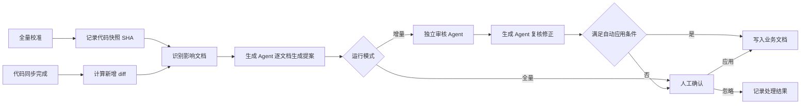

# 基于最新代码自动更新业务文档

## 1. 目标

系统提供两种更新路径：

1. **全量校准**：根据所有启用仓库的当前代码，检查全部业务文档。
2. **增量更新**：代码同步后，根据新增代码变更，只检查受影响的业务文档。

系统只在代码证明稳定业务语义发生变化时生成内部更新提案。增量提案经独立审核 Agent 审查、生成 Agent 复核后自动写入；存在冲突、低置信度或高风险变化时转人工确认。代码只能证明当前实现，不能替代产品决策。

## 2. 当前实现与改造范围

当前已经存在一套 PR 驱动的业务文档更新功能：

```text
GitHub PR → PR diff → 更新提案 → 用户应用或忽略
```

新方案改为：

```text
本地代码快照或 commit diff → 更新提案 → 独立审核 Agent → 生成 Agent 复核 → 自动应用或转人工
```

保留：

- 提案文件、业务文档 sidecar。
- 任务执行和 Agent Runtime。
- 提案详情、审核记录、异常“待更新”、人工应用、忽略和引用到对话。
- 文档 hash 冲突检查。

调整：

- 业务文档更新不再依赖 GitHub PR。
- 删除业务文档更新专用的 PR Webhook、PR 任务和 PR 重建接口。
- PR 自动代码 Review 不受影响。

## 3. 总体流程



“记录代码快照 SHA”只保存 commit 标识，不锁仓库、不切分支、不阻塞定时 `git pull`。分析通过指定 SHA 读取代码；运行期间产生的新提交交给下一次增量任务处理。

## 4. 代码范围

### 仓库开关

业务文档同步使用独立配置，不复用代码 Review 的 `enabled` 或 PR 关联的 `pr_link_enabled`：

```json
{
  "repo_full_name": "example-org/coinex_anti_fraud_service",
  "workspace_repo_path": "/srv/coinex/code/coinex_anti_fraud_service",
  "default_branch": "master",
  "business_doc_enabled": true,
  "business_doc_role": "domain",
  "business_doc_scopes": [
    "07_risk_domain/09_anti_fraud.md"
  ]
}
```

- `business_doc_enabled`：是否参与全量和增量业务文档更新。
- `business_doc_role`：`domain`、`gateway` 或 `frontend`，用于确定证据优先级。
- `business_doc_scopes`：允许该仓库影响的业务文档路径；不得越过配置范围修改其他文档。

### 正式纳入范围

| 优先级 | 仓库 | 主要文档范围 |
| --- | --- | --- |
| P0 | `example_backend` | 用户、资产、理财、P2P、营销及跨服务编排 |
| P0 | `coinex_api_backend` | 现货、合约 API、订单、仓位、交易校验和交易风控 |
| P0 | `coinex_anti_fraud_service` | `07_risk_domain/09_anti_fraud.md` |
| P0 | `coinex_information_backend` | 资讯、话题聚合、AI 研报 |
| P0 | `coinex_exchange_server` | 现货撮合、成交和交易状态 |
| P0 | `coinex_perpetual_server` | 永续合约、仓位、资金费率、强平和风险处理 |
| P1 | `coinex_admin_frontend_3` | 管理后台交互、前端校验和运营流程 |
| P1 | `coinex_comment` | 评论、审核、评分和消息流程 |
| P1 | `coinex_translate_server` | 翻译、内容审核和 AI 分析流程 |

`coinex_exchange_server` 和 `coinex_perpetual_server` 虽然本地开发机没有 checkout，但服务器端存在，因此纳入正式运行范围。生产配置必须填写服务器上的真实 `workspace_repo_path` 和默认分支。

每个启用仓库必须满足：

- `workspace_repo_path` 存在且是 Git 仓库。
- 当前分支等于配置的默认分支。
- 仓库配置属于当前组织。
- 使用独立、干净、由系统维护的 checkout，不直接使用开发人员的功能分支。

### 跨仓库证据优先级

同一业务规则在多个项目出现时，按以下顺序判断：

```text
领域服务实际规则 > API 或编排层 > 前端展示与校验
```

例如：

- 评论规则以 `coinex_comment` 为准，`example_backend` 的转发代码只证明调用关系。
- 资讯规则以 `coinex_information_backend` 为准。
- 反欺诈规则以 `coinex_anti_fraud_service` 为准。
- 现货撮合规则以 `coinex_exchange_server` 为准。
- 合约、资金费率和强平规则以 `coinex_perpetual_server` 为准。
- 一般业务以 `example_backend` 为准。

## 5. 路径一：全量校准

### 触发

管理员手动点击“按最新代码全量检查”。第一版不增加定时全量任务。

### 流程

1. 读取所有 `business_doc_enabled=true` 的仓库并记录当前 branch 和 HEAD SHA。
2. 生成代码快照 ID。
3. 枚举业务文档根目录下全部可见 Markdown，排除 `__meta__`、`html` 和隐藏目录。
4. 为每份业务文档创建独立分析任务，但同时并发不能超过 3 个，任务多了以后排队。
5. Agent 按 `business_doc_scopes` 和证据优先级检索相关路由、模型、状态、服务和配置。
6. 文档与代码一致，记录 `no_update_needed`。
7. 文档与代码不一致，生成单文档更新提案。
8. 发现没有对应文档的业务能力，生成 `new_doc_candidate`，不直接创建文件。
9. 所有文档分析成功后，把快照 HEAD 记录为各仓库的 `analyzed_head`。

### 完成条件

每份业务文档都必须有一个结果：

- `update_required`
- `no_update_needed`
- `failed`

存在 `failed` 时不建立增量基线，只重试失败任务。

### 约束

- 全量校准时间会很长，需要持久化记录进度，并且在服务器失败、重启的情况下，可以继续。
- admin 端启动校准后，应该能看到进度展示。

## 6. 路径二：增量更新

### 触发

扩展现有 `code_sync_loop` 的单仓库同步结果：

```python
RepoSyncResult(
    repo_name,
    repo_path,
    old_head,
    new_head,
    changed_files,
    errors,
)
```

当同步成功且 `old_head != new_head` 时，持久化一个增量更新任务。

### 变更范围

每个仓库保存一个 `analyzed_head`。实际分析范围为：

```text
analyzed_head..current_head
```

不直接依赖本轮 `git pull` 的 old/new HEAD，避免服务在拉取后异常退出造成变更丢失。

### 影响识别

按以下证据确定受影响文档：

1. 业务文档 sidecar 中已有的代码文件和符号引用。
2. 变更路径与业务域、API、模型、状态和服务的结构关系。
3. Agent 根据 diff 和当前代码做业务影响判断。

纯重构、测试、注释、格式化和不改变外部行为的技术调整记录为 `no_update_needed`，不显示“待更新”。

删除或重命名文件时必须同时读取旧版本和新版本，不能只看当前文件树。

### 审核与自动应用

增量提案只进行一轮攻防审核，避免形成无休止的 Agent 循环：

1. 生成 Agent 根据代码证据生成单文档提案。
2. 独立审核 Agent 从反方检查证据、业务语义、遗漏和文档边界。
3. 生成 Agent 根据审核意见复核一次，修正或撤销提案。
4. 通过自动应用条件后写入正式文档，并保存完整审核记录。

满足以下任一条件时不得自动应用，转人工确认：

- 复核后两个 Agent 的结论仍不一致。
- 缺少可靠代码证据、跨仓库实现冲突或置信度低于阈值。
- 涉及业务规则删除、角色权限、资金或风控。
- 需要新建业务文档，或目标文档在分析期间被人工修改。

### 连续变更

如果受影响文档已有待处理提案：

1. 根据当前最新代码重新生成完整提案。
2. 将旧提案标记为 `superseded`。
3. 禁止继续应用旧提案。

### 游标推进

- 所有分析任务成功：`analyzed_head = current_head`。
- 任一分析任务失败：不推进游标，重试同一变更区间。
- 游标不等待自动应用或人工处理；“已经分析”和“已经应用”是两个状态。

## 7. 数据模型

### `business_doc_update_runs`

记录一次全量或增量运行：

| 字段 | 说明 |
| --- | --- |
| `run_id` | 运行 ID |
| `mode` | `full` / `incremental` |
| `status` | `pending` / `running` / `completed` / `completed_with_errors` / `failed` |
| `snapshot_id` | 代码快照 ID |
| `repo_key` | 增量任务所属仓库 |
| `base_sha` / `head_sha` | 增量范围 |
| `total_items` / `completed_items` / `failed_items` | 进度 |

幂等约束：

- 全量：`mode + snapshot_id` 唯一。
- 增量：`mode + repo_key + base_sha + head_sha` 唯一。

### `business_doc_update_items`

记录单份文档的分析任务：

| 字段 | 说明 |
| --- | --- |
| `item_id` / `run_id` | 任务和所属运行 |
| `source_path` / `source_hash` | 目标文档和生成时 hash |
| `result_type` | `update_required` / `no_update_needed` / `new_doc_candidate` |
| `status` | `pending` / `running` / `completed` / `failed` |
| `update_id` / `update_path` | 提案信息 |
| `evidence_json` | 仓库、commit、文件和符号证据 |

增量任务同时记录 review_status、review_feedback、confidence 和 apply_status，用于追踪独立审核、生成 Agent 复核及自动应用结果。

### `business_doc_repo_cursors`

记录每个仓库最近完成分析的 `analyzed_head` 和 `last_run_id`。

继续使用现有 business_doc_update_actions 记录自动或人工执行的 applied、ignored 和 superseded，并记录审核角色与原因。

## 8. 提案与文档约束

提案是系统内部可审计的单文档变更单，不是 GitHub PR。每份提案只对应一份业务文档，必须包含：

- 运行模式、目标文档和代码版本。
- 稳定业务语义的变化及当前文档差异。
- 仓库、commit、文件和符号证据，以及跨仓库冲突情况。
- 独立审核结论、生成 Agent 复核结果和置信度。
- 自动应用或转人工的原因，以及最终文档正文。

提案根目录从当前组织的知识库路径推导：

```text
<knowledge_root>/__reviews__/business-doc-update/
```

业务文档 sidecar 保存最新提案和代码证据索引，不作为业务事实来源。

### 业务文档内容边界

业务文档是业务骨架，更新策略以高精度、低频率为目标：

- 默认不更新；只有稳定业务语义变化才允许修改。
- 只记录业务目标、角色、核心规则、主流程、状态流转和外部约束。
- 不记录类名、函数名、接口参数、表字段、内部调用链和一般异常分支。
- 重构、性能优化、测试、格式调整和技术组件替换通常不触发更新。
- 优先修改、归并或压缩既有内容，禁止以不断追加实现说明的方式更新。
- 无法判断是否属于稳定业务规则时不自动写入，转人工确认。

## 9. API 与页面

### 新增 API

| 方法 | 路径 | 用途 |
| --- | --- | --- |
| `POST` | `/api/business-docs/update-runs/full` | 触发全量校准 |
| `GET` | `/api/business-docs/update-runs` | 查询运行列表 |
| `GET` | `/api/business-docs/update-runs/{run_id}` | 查询运行进度 |
| `POST` | `/api/business-docs/update-runs/{run_id}/retry` | 重试失败任务 |

增量任务只允许由 `code_sync` 内部创建，客户端不能提交任意 SHA。

### 保留 API

- 查询提案、审核结论和自动应用记录。
- 查询提案详情和代码证据。
- 人工应用或忽略需要确认的异常提案。

### 页面

- 管理员可触发全量校准并查看进度。
- 自动应用的增量提案进入审核记录，不产生用户待办。
- 只有转人工的异常提案显示“待更新”标签。
- 提案详情显示来源模式、代码版本、证据、两次审核结论和 Markdown diff。
- superseded 提案只读，不显示应用按钮。

## 10. 安全与恢复

- 不锁仓库，不切分支，不执行 `reset`，不阻塞代码定时同步。
- 自动或人工应用前校验业务文档 source_hash；不一致则拒绝覆盖并转人工确认。
- 提案只能修改声明的目标文档，路径必须位于业务文档根目录。
- 同一仓库同时只执行一个增量任务。
- 全量运行期间代码可以继续同步；全量结束后增量补齐快照之后的变化。
- 服务启动时比较 `analyzed_head` 和当前 HEAD，自动补建遗漏的增量任务。
- `analyzed_head` 不是当前 HEAD 的祖先时停止增量分析，要求重新全量校准。
- 生产环境任一 P0 仓库不可读时，全量任务失败；其他仓库按单仓库失败记录，不影响已完成结果。

## 11. 验收标准

### 全量校准

- 所有 `business_doc_enabled` 仓库都记录准确的 branch 和 HEAD。
- 生产环境的 P0 仓库全部参与分析，包括服务器端的 `coinex_exchange_server` 和 `coinex_perpetual_server`。
- 每份业务文档都有明确分析结果。
- 相同代码快照不会重复创建任务。
- 失败时不错误建立增量基线。

### 增量更新

- 代码同步后按 analyzed_head..current_head 分析。
- 默认不更新；纯技术变更和不稳定实现细节不生成提案。
- 删除、重命名和跨模块影响能够识别。
- 每份提案完成一次独立审核和一次生成 Agent 复核。
- 符合条件的提案自动应用，异常提案进入人工待办。
- 服务异常退出后不会丢失代码变更，连续变更会使旧提案失效。

### 审核与应用

- 每条业务结论可以追溯到代码版本、代码证据和两次审核记录。
- 审核 Agent 能识别错误结论、证据不足和实现细节过载。
- 业务文档被人工修改后，旧提案不能自动覆盖它。
- 资金、风控、权限、规则删除和低置信度变化必须转人工。
- applied、ignored、superseded 都会结束该提案的待处理状态。

## 12. 实现顺序

1. 新增 `business_doc_enabled`、`business_doc_role` 和 `business_doc_scopes` 仓库配置。
2. 在服务器配置 P0 仓库的真实 checkout 路径和默认分支。
3. 新增 run、item、repo cursor 数据模型。
4. 实现代码快照、diff、祖先关系和跨仓库证据优先级。
5. 改造 BusinessDocUpdateService 和 business-doc-updater Skill，增加独立审核 Agent。
6. 实现全量校准、API 和进度页面，建立首个基线。
7. 扩展 `code_sync_loop`，接入增量任务。
8. 实现双 Agent 复核、自动应用、人工降级、连续变更合并和旧提案失效。
9. 删除业务文档更新专用的 PR 入口。
10. 补齐全量、增量、双 Agent 分歧、自动应用边界、文档精简、缺失 P0 仓库、跨仓库冲突、恢复和路径安全测试。
