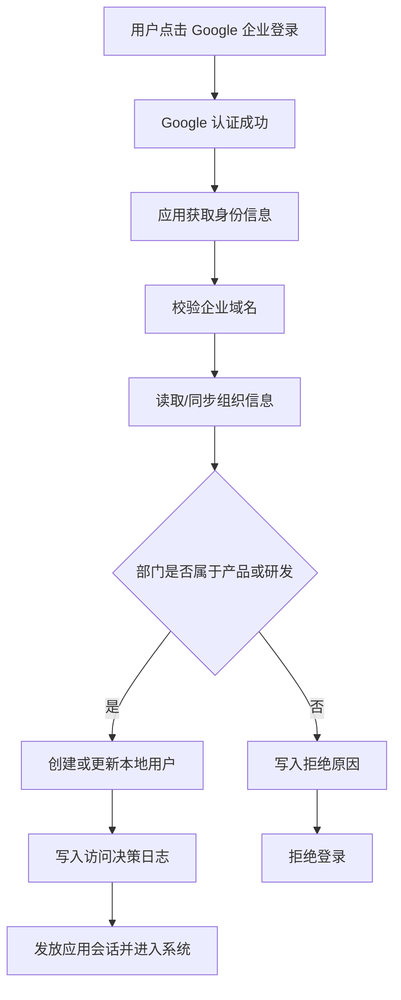

# ai-prd 用户认证与访问机制设计

## 1. 文档信息

- 项目名称：ai-prd
- 文档名称：用户认证与访问机制设计
- 文档版本：V1.0
- 文档日期：2026-04-13
- 文档状态：草案

---

## 2. 设计目标

本方案用于为 `ai-prd` 设计一套可落地的用户机制，满足以下目标：

- 与 Google 企业账号体系集成，使用企业账号完成注册和登录
- 同步或识别企业组织结构，用于判断用户是否属于允许使用的部门
- 在当前阶段，只允许**产品部门**和**研发部门**成员注册、登录并完整使用系统
- 尽量不引入复杂权限模型，但为未来更细粒度授权保留扩展空间

---

## 3. 当前阶段的产品约束

### 3.1 当前权限策略

当前版本的权限非常简单，产品层只区分“允许使用”和“不允许使用”两种结果：

- 允许使用：产品部门、研发部门员工
- 不允许使用：其他部门员工、外部账号、无法识别组织归属的账号

对于被允许使用的用户，当前默认拥有完整的产品使用权限，包括：

- 登录系统
- 创建和进入会话
- 浏览知识库
- 使用 Skill
- 发起分析任务

Skill 管理是对象级权限的明确例外：用户可以浏览和使用全部 Skill，但只能编辑、删除自己创建的 Skill；管理员可以管理全部 Skill，操作他人 Skill 时必须明确确认。没有可信所有权记录的历史 Skill 仅允许管理员处理。

也就是说，现阶段的业务权限本质上是一个**部门准入机制**，而不是完整的细粒度授权系统。

### 3.2 当前不做复杂授权

当前阶段暂不把以下能力作为主设计目标：

- 不做复杂的页面级、按钮级、对象级权限控制
- 不做多层级审批流
- 不做外部客户、多租户隔离
- 不做大量自定义角色编排

但底层模型需要支持未来平滑升级到：

- 角色权限
- 资源范围授权
- 管理后台授权
- 工作区级或知识源级授权

---

## 4. 核心设计原则

- 企业身份优先：不支持独立本地账号注册，统一以 Google 企业身份为准
- 首登即注册：用户第一次通过企业 Google 登录并校验通过后，自动创建本地账号
- 组织归属驱动准入：是否允许使用，优先依据企业组织结构和部门归属判断
- 认证与授权分离：Google 负责“你是谁”，应用负责“你能不能进、进来后能做什么”
- 简单策略优先：当前只实现最小可用的准入规则，不为了未来预埋过多交互复杂度
- 模型预留扩展：虽然当前只有“允许/拒绝”，但底层数据模型要支持未来更复杂的授权机制

---

## 5. 用户机制总体方案

### 5.1 总体思路

`ai-prd` 的用户机制建议拆成三层：

1. 身份认证层
2. 组织同步层
3. 访问决策层

三层职责分别如下：

#### 身份认证层

负责确认用户是谁。

建议方案：

- 使用 Google 企业账号登录
- 基于 Google OAuth 2.0 / OpenID Connect 获取用户身份
- 应用侧以企业邮箱和 Google 用户唯一标识作为主身份依据

#### 组织同步层

负责确认用户属于哪个组织、部门和员工体系。

建议方案：

- 从 Google Workspace 的用户资料或 Directory 能力读取组织相关信息
- 将组织、部门、直属关系等信息同步到本地用户目录
- 把“产品部门”“研发部门”维护为系统可识别的准入范围

#### 访问决策层

负责判断该用户是否允许进入 `ai-prd`。

当前规则非常简单：

- 企业域名合法
- 用户账号有效
- 用户所在部门属于产品或研发

满足以上条件，则允许登录并完整使用；否则拒绝进入。

---

## 6. 用户生命周期设计

### 6.1 用户来源

当前阶段，系统中的用户只来源于企业 Google 身份。

因此不建议保留传统意义上的：

- 用户名密码注册
- 邮箱验证码注册
- 邀请码注册

更符合当前产品约束的方式是：

- 用户点击“使用 Google 企业账号登录”
- 认证成功后，系统读取企业邮箱和组织信息
- 如果满足准入规则，则自动完成本地开户

### 6.2 首次注册

当前产品中的“注册”建议定义为：**企业用户首次成功登录并通过准入校验时，系统自动创建本地用户记录。**

首次注册时建议写入以下信息：

- 用户唯一标识
- Google 账号唯一标识
- 企业邮箱
- 姓名 / 昵称
- 头像
- 所属部门
- 所属组织单元
- 员工状态
- 首次登录时间
- 最近登录时间
- 当前访问状态

### 6.3 用户状态

建议用户拥有以下基础状态：

- `pending`
  - 已通过 Google 认证，但组织信息未同步完成，暂不能使用
- `active`
  - 已通过准入校验，可正常使用系统
- `denied`
  - 已识别身份，但不属于允许准入的部门
- `suspended`
  - 曾经可用，但被管理员手动停用或企业状态已失效
- `inactive`
  - 长期未使用，可作为运营状态保留，不影响历史数据

当前主流程里真正常用的是：

- `active`
- `denied`
- `suspended`

---

## 7. 认证机制设计

### 7.1 登录方式

建议当前版本只提供一种登录方式：

- `使用 Google 企业账号登录`

不建议在产品首期同时开放：

- 本地密码登录
- 多身份提供方并行登录
- 游客模式

这样可以确保：

- 身份源唯一
- 准入规则简单
- 后续审计与离职失效更容易统一处理

### 7.2 认证结果

Google 认证成功后，应用侧至少需要获得以下身份信息：

- `google_user_id`
- `email`
- `email_verified`
- `name`
- `picture`
- `hosted_domain`

其中最关键的判断项是：

- 是否为企业受管邮箱
- 是否属于指定企业域
- 是否能关联到组织结构信息

### 7.3 推荐校验顺序

建议应用在回调阶段按以下顺序做校验：

1. 校验 Google 登录是否成功
2. 校验邮箱是否为已验证邮箱
3. 校验邮箱域名是否属于公司企业域
4. 拉取或匹配组织信息
5. 判断部门是否属于产品或研发
6. 创建或更新本地用户
7. 发放应用会话

只要第 3、4、5 步失败，就不应让用户进入主系统。

---

## 8. 组织结构接入设计

### 8.1 组织结构的产品作用

在 `ai-prd` 中，组织结构当前主要不是为了展示通讯录，而是为了支持访问决策。

当前最核心的用途只有一个：

- 判断用户是否属于允许使用系统的部门

但组织结构未来还能支持：

- 默认推荐知识范围或工作区
- 审计报表按部门统计
- 管理员按部门开通策略
- 不同部门看到不同的知识源或 Skill

### 8.2 当前建议同步的组织字段

建议应用本地至少保留以下组织字段：

- `org_unit_id`
- `org_unit_name`
- `department_id`
- `department_name`
- `manager_email`
- `employment_status`
- `cost_center`（可选）
- `location`（可选）

如果 Google 侧无法稳定直接给到“部门”字段，则需要在应用侧维护一层映射规则，把：

- Google Org Unit
- 自定义用户属性
- 企业邮箱域或别名规则

统一映射为产品内部可识别的：

- 产品部门
- 研发部门
- 其他部门

### 8.3 组织同步策略

建议采用“登录时校验 + 后台定时同步”双轨机制：

#### 登录时校验

在用户登录时，实时读取或校验该用户的最新组织归属，用于决定是否允许本次进入系统。

优点：

- 准入判断及时
- 离岗、转岗影响能尽快生效

#### 后台定时同步

系统后台定期同步企业组织信息到本地目录。

优点：

- 便于做批量状态更新
- 便于做组织统计与后续授权扩展
- 减少每次登录都做完整组织拉取的成本

### 8.4 当前阶段的部门识别规则

建议先使用一套显式可配置的准入部门名单，例如：

- `Product`
- `Product Management`
- `PM`
- `Engineering`
- `R&D`
- `RD`

应用内部再将它们归一成两类业务部门：

- 产品部门
- 研发部门

这样做的原因是，企业实际组织命名往往不会完全统一，产品侧需要有一层映射，而不是把 Google 原始字段直接写死进业务逻辑。

---

## 9. 访问控制机制设计

### 9.1 当前访问模型

当前建议采用最简单的访问模型：

- 认证通过
- 企业域名合法
- 部门命中准入名单
- 进入系统后默认拥有完整业务使用权限

这意味着当前版本从业务上只有一种标准用户角色：

- `member`

`member` 在当前版本下可以完整使用 `ai-prd` 的主要业务能力。

### 9.2 管理角色建议

虽然业务权限当前很简单，但系统层仍建议保留一个极小的后台管理角色：

- `admin`

`admin` 的职责不一定是业务使用权限更大，而是承担系统配置类职责，例如：

- 维护允许接入的企业域
- 维护部门映射规则
- 查看用户准入结果
- 手动停用异常账号

因此，当前版本建议把“业务能力权限”和“后台管理权限”分开理解：

- 业务使用权限：当前被允许的用户基本一致
- 系统管理权限：少量管理员拥有

### 9.3 访问决策结果

当前登录后建议只产生三种主结果：

- `allow`
  - 允许进入系统
- `reject_department`
  - 身份合法，但不在产品/研发部门
- `reject_identity`
  - 不是合法企业身份，或组织信息异常

这三种结果已经足够支撑首期产品。

---

## 10. 推荐的业务对象模型

为了兼顾当前简单需求和未来扩展，建议用户机制至少包含以下业务对象。

### 10.1 用户

用户是本地应用中的主体账号记录。

建议字段：

- `user_id`
- `email`
- `name`
- `avatar_url`
- `status`
- `default_role`
- `last_login_at`
- `first_login_at`

### 10.2 外部身份

外部身份用于记录该用户与 Google 企业账号的绑定关系。

建议字段：

- `identity_id`
- `user_id`
- `provider`
- `provider_user_id`
- `provider_email`
- `hosted_domain`
- `email_verified`
- `linked_at`
- `last_verified_at`

### 10.3 组织成员关系

组织成员关系用于表示用户当前的组织归属。

建议字段：

- `membership_id`
- `user_id`
- `org_unit_id`
- `org_unit_name`
- `department_code`
- `department_name`
- `manager_email`
- `employment_status`
- `effective_from`
- `effective_to`

### 10.4 访问策略

访问策略用于表达系统当前允许哪些用户进入。

建议字段：

- `policy_id`
- `policy_type`
- `match_field`
- `match_operator`
- `match_value`
- `effect`
- `priority`
- `status`

当前阶段可以只配置少量规则，例如：

- 允许企业域 `company.com`
- 允许部门 `Product`
- 允许部门 `Engineering`

### 10.5 访问决策日志

访问决策日志用于记录每次登录判断的依据，方便排查和审计。

建议字段：

- `decision_id`
- `user_id`
- `identity_id`
- `decision_result`
- `matched_policy`
- `decision_reason`
- `decided_at`

---

## 11. 登录与准入流程

### 11.1 主流程

### 11.2 用户体验建议

对于当前版本，登录页建议尽量简单：

- 显示产品名称与一句话说明
- 仅提供一个主按钮：`使用 Google 企业账号登录`
- 在按钮下说明当前开放范围：`当前仅面向产品与研发部门开放`

如果用户被拒绝，提示文案建议清楚但克制，例如：

- 你的企业账号已识别，但当前不在系统开放部门范围内
- 当前版本仅支持产品与研发部门使用，如有需要请联系管理员

---

## 12. 管理机制建议

### 12.1 管理员需要可配置的内容

首期建议只开放少量后台配置：

- 企业允许域名列表
- 部门映射规则
- 准入部门名单
- 用户状态手动停用 / 恢复

### 12.2 管理员需要可查看的内容

- 用户列表
- 当前组织归属
- 最近登录时间
- 最近准入结果
- 被拒绝原因

这样已经足够支撑当前阶段的运维和问题排查。

---

## 13. 面向未来的扩展方式

虽然当前权限模型很简单，但这套设计建议沿着以下方向扩展：

### 13.1 从部门准入升级到角色授权

未来可以在“是否允许进入”之外，增加：

- 产品经理
- 研发工程师
- 测试工程师
- 管理员
- 审核者

等角色定义。

### 13.2 从全量可用升级到范围授权

未来可以继续细化为：

- 哪些部门可以看哪些知识源
- 哪些角色可以管理 Skill
- 哪些人可以配置组织策略
- 哪些人可以访问特定代码知识或项目空间

### 13.3 从静态规则升级到策略引擎

未来如果授权复杂度明显上升，可以把当前“部门白名单”升级为：

- 角色 + 部门
- 角色 + 资源范围
- 组织层级 + 数据域
- 审计策略 + 风险控制

但在首期没有必要一步做到位。

---

## 14. 当前结论

当前阶段，`ai-prd` 的用户机制建议被定义为：

> 一套基于 Google 企业身份认证、以组织结构识别为准入依据、以产品部门和研发部门白名单为当前授权边界的轻量用户机制。

它的关键特征是：

- 不做本地账号体系
- 首登即注册
- 组织归属决定能否进入
- 当前允许进入的用户拥有完整业务使用权限
- 数据模型上为未来更复杂授权保留扩展空间

这套设计既能满足“先把合适的人放进系统里”的当前目标，也不会阻碍后续演进到更复杂的企业授权体系。
